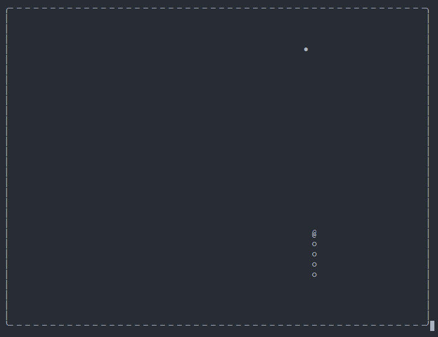

# nodejs 命令行小游戏 - 贪吃蛇

> a termial game - greedy snake - by nodejs



方向键控制小蛇转向, 按住前进方向的方向键可以加速前进, 小蛇吃到`鸟蛋`后速度会有所提升, 蛇头撞到蛇身或墙壁游戏结束  
Arrow keys for snake's direction. Press and hold the forward arrow key to accelerate. Eating a `bird's egg` will speed it up. Game over when the snake meets the wall or itself.  

## 如何开始游戏 How
```bash
# 先安装依赖
npm install

# 运行游戏
npm start
```

## 经测试, 以下环境可流畅运行 Where
- win10 `cmd`
- win10 `wsl`